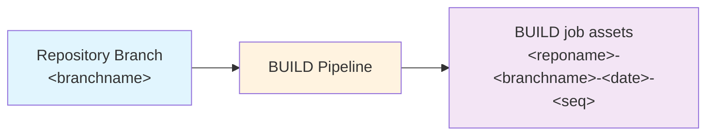

# Building Releases

The `BUILD` pipeline collates a numbered 'release' by extracting and building the assets required to deploy from source control. This can then be used later to deploy to any number of environments using the exact same, unchanged assets.

The `BUILD` job triggers automatically when any changes are made in the associated repo, including when `EXPORT` completes (unless no changes were found).

To monitor:

**Azure DevOps:**
1) Navigate to the **Pipelines** area of your AzDO project.
2) Select the **All** tab and navigate to the folder with the same name as your repo. (If you only have one repo, this will be the same as your project name by default.)
3) Select the `BUILD` pipeline and then select an instance of the job.
4) The view will switch automatically to show progress. Wait until it is shown as successful.

**GitHub Actions:**
1) Navigate to the **Actions** tab of your repository.
2) Select the **BUILD** workflow from the left panel.
3) Select the running workflow run. Wait until it is shown as successful (green checkmark).

What happens:

- Solution(s) are packed from the folders in source control at `solutions/uniquename` using PAC solution pack. A managed solution is generated and added to the build assets.
- BUILD can optionally be associated with a global Dataverse validation environment. When configured, BUILD runs the same Dataverse connect/authentication flow as EXPORT before running build + solution validation.
- If `solutionCheck.enabled = $true` (globally and/or per-solution), each packed solution is validated with `pac solution check`.
  - Multiple solutions are processed in parallel (`solutionCheck.maxParallel`, default `4`).
  - Build failure threshold is controlled by `solutionCheck.failThreshold` (default `Critical`).
- If you've configured any hook extensions in `alm-config.psd1`, these will be executed and can add to the build steps and the assets.
- Any additional paths configured in `assets` will be copied to the build assets.
- The configuration and scripts for the deployment process are also copied to the build assets to ensure that everything is frozen in time.

Solution check report outputs:

- In build artifacts under `solution-check/`
  - `summary.md`
  - `solution-check-summary.json`
  - per-solution PAC logs/output
- As a dedicated CI artifact named `solution-check-report` for quick access from pipeline/workflow results.

If checks fail, the logs clearly state which solution breached the configured threshold and what the highest severity was.

What to do next:

- The `DEPLOY-<branchname>` pipeline triggers automatically if the job completes successfully.
  See [Deploying](deploying.md) for information.
